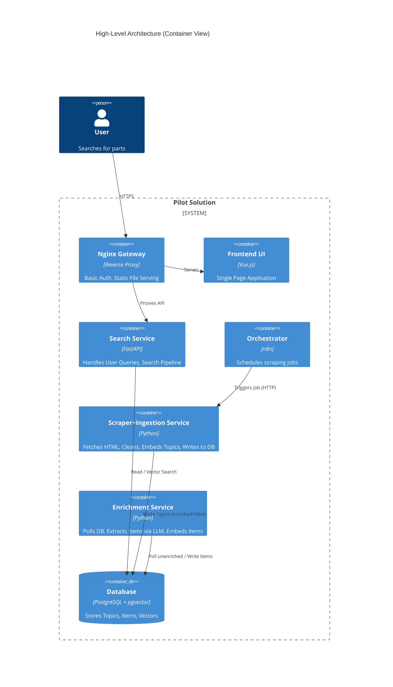
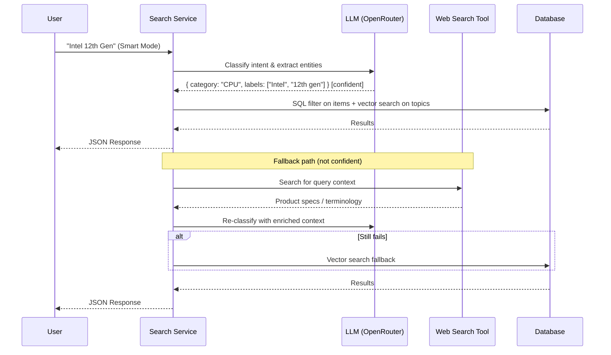

# Architecture Document
## Pilot Solution for Used Electronics Discovery

> **Version 1.8** | Event-Driven Workflow via Webhooks

---

## Table of Contents

1. [Executive Summary](#1-executive-summary)
2. [Problem Statement](#2-problem-statement)
3. [Functional Requirements](#3-functional-requirements)
4. [Non-Functional Requirements](#4-non-functional-requirements)
5. [Constraints & Assumptions](#5-constraints--assumptions)
6. [Risks & Mitigations](#6-risks--mitigations)
7. [Architectural Decision Log (ADR)](#7-architectural-decision-log-adr)
8. [High-Level Architecture](#8-high-level-architecture)
9. [Component Responsibilities](#9-component-responsibilities)
10. [Data Flow Description](#10-data-flow-description)
11. [Data Model](#11-data-model)
12. [Infrastructure & Deployment](#12-infrastructure--deployment)
13. [Scalability & Failure Strategy](#13-scalability--failure-strategy)
14. [Security Considerations](#14-security-considerations)
15. [Future Evolution](#15-future-evolution)
16. [Frontend Specification](#16-frontend-specification)
17. [Project Structure](#17-project-structure)

---

## 1. Executive Summary

This document defines the architecture for a pilot system designed to aggregate, structure, and search used computer parts from the Overclockers.ua forum. The solution addresses the cognitive load of manual forum browsing by automating the extraction of unstructured "mixed offerings" into a structured, queryable product catalog.

The system utilizes a **Service-Oriented Architecture (SOA)** deployed via **Docker Compose** on local hardware. It leverages **Large Language Models (LLMs)** for structured extraction (Extraction Pipeline) and semantic query analysis (Search Pipeline), with services communicating via direct HTTP calls and a shared PostgreSQL database.

---

## 2. Problem Statement

Users attempting to buy specific computer parts on forum threads face several challenges:

- **Mixed Offerings:** A single topic often lists multiple distinct items (CPU, GPU, RAM) with different prices, making topic-level search ineffective.
- **Semantic Gap:** Keyword search fails to match synonyms (e.g., "DDR5" vs. "PC5-48000") or hierarchical concepts (searching "RAM" misses "DDR4").
- **Unstructured Pricing:** Prices are embedded in free-text, preventing sorting or filtering.
- **High Variance:** Listing formats vary significantly between sellers and languages (UA/RU/EN).

---

## 3. Functional Requirements

1. **Automated Scraping:** Periodically fetch forum topics. The number of pages to scrape is configurable via a request parameter to the Scraper+Ingestion service — there is no hardcoded default. The scraping interval is configurable via n8n.

2. **Content Cleaning:** Remove HTML, spoilers, and strikethrough (sold) text.

3. **Extraction Pipeline:** Split "mixed offerings" (single post, multiple items) into distinct database records with structured metadata (Category, Specs, Price). Embeddings for both Topics and Items are generated during this phase.

4. **Hybrid Search (Search Pipeline):** Two modes selectable via UI toggle:
   - **Simple Mode:** Vector search over item embeddings.
   - **Smart Mode:** LLM agent analyzes query, extracts Category and a list of matching Labels, executes SQL + vector search. Two ranking algorithms:
     - **Recall (default):** Original hybrid scoring with label containment match count + cosine similarity tiebreaker.
     - **Precision:** IDF-weighted containment scoring with soft length regularization. Uses `label_stats` and `search_stats` tables for term importance weighting.
   - **Auto-tune:** Smart mode can automatically lower the minimum score threshold (starting at 0.6) until results are found or threshold reaches 0.

5. **Sorting & Filtering:** Sort by Price, Creation Date (Newest/Oldest), Update Time; Filter by Standalone vs. Mixed; Filter by minimum score threshold.

6. **Multilingual Support:** Handle listings in Ukrainian, Russian, and English.

---

## 4. Non-Functional Requirements

- **Scalability:** Support ~500 active topics; low concurrency (<10 users).
- **Latency:** Search Simple Mode `<200ms`; Smart Mode `<15s`. Data freshness lag is best-effort — see [Section 10](#flow-1-ingestion--enrichment-pipeline) for the freshness model.
- **Cost Efficiency:** Operational cost `<$50/mo` via optimized LLM usage on OpenRouter.
- **Deployability:** Fully containerized via Docker Compose.
- **Resiliency:** Failure of the Scraper+Ingestion service must not impact Search availability.

---

## 5. Constraints & Assumptions

| ID | Constraint | Impact |
|----|------------|--------|
| **C1** | Budget `<$50/mo` | Use open-weight models via OpenRouter; minimize unnecessary LLM loops. |
| **C2** | Local Hardware | System must run on a single server (Home Lab) via Docker. |
| **C3** | Polite Scraping | Must mimic a browser (User-Agent) and respect rate limits. |
| **C4** | No Auth Logic | No app-level user management; relies on infrastructure-level Basic Auth (internal home lab). |
| **C5** | Mixed Languages | Embeddings and LLMs must support UA/RU/EN. |

**Assumption:** The forum structure (HTML classes/IDs) remains relatively stable.

---

## 6. Risks & Mitigations

| Risk | Impact | Mitigation |
|------|--------|------------|
| **IP Ban / Blocking** | Scraper stops working. | Configurable rate limiting: `bulk_size` (default 10 concurrent requests), `bulk_delay_ms` (default 2000ms delay between batches), `page_count` (configurable pages per run). Configurable `user_agent` header via environment variable. Randomize intervals via n8n; rotate User-Agents; implement back-off logic. |
| **LLM Hallucination** | Extracted price/specs are wrong. | Use Pydantic for strict schema validation; retain `raw_text_segment` for manual verification. |
| **Cost Overrun** | LLM calls drain API credits. | Hard limits on recursion depth; skip re-enrichment when `content_hash` is unchanged. |
| **Data Variance** | Mixed offerings too complex to parse. | Flag "Unparseable" items for manual review; do not discard parent topic. |
| **Stale Topics** | Updated topics not re-scraped if they sink below configured page depth. | Documented limitation — see [Freshness Model](#freshness-model--lag-guarantee). |

---

## 7. Architectural Decision Log (ADR)

| Decision | Option Selected | Trade-off / Reasoning |
|----------|-----------------|-----------------------|
| **Orchestration** | n8n (Thin Scheduler) | Pros: Visual scheduling, easy error alerts. Cons: Adds a container. Reason: Decouples scheduling from application logic. |
| **Architecture Style** | Service-Based (Decoupled) | Pros: Independent scaling/testing of Scraper+Ingestion vs. Enrichment vs. Search. Cons: More infrastructure complexity. |
| **Embedding Model** | `intfloat/multilingual-e5-large` | Pros: Superior performance on UA/RU/EN technical text. Cons: Higher RAM. Reason: Crucial for search relevance. |
| **Database** | PostgreSQL + pgvector | Pros: Relational data (Price) + Vectors in one engine. No separate Vector DB needed. |
| **Inter-service Communication** | Direct HTTP + DB polling | Pros: Simpler stack — no message broker required. Enrichment polls DB for unenriched records. Cons: Slight polling overhead (acceptable at pilot scale). |
| **Scraper + Ingestion Merged** | Single combined service | Fetching raw HTML and processing it into clean DB records is treated as one atomic operation. Reduces inter-service complexity with no meaningful loss of modularity at pilot scale. |

---

## 8. High-Level Architecture

The system follows a **Service-Oriented Architecture** where distinct functional areas are separated into isolated containers, communicating via direct HTTP and a shared PostgreSQL database.



---

## 9. Component Responsibilities

| Service | Technology                      | Responsibility |
|---------|---------------------------------|----------------|
| **Frontend** | Vue 3 + Tailwind                | Displays search interface with Simple/Smart mode toggle, offering cards, and filters. |
| **Search Service** | FastAPI                         | **API Layer:** Exposes search endpoints. **Search Pipeline:** Implements Simple (vector) and Smart (LLM agent + SQL + vector fallback) search modes. |
| **Scraper+Ingestion Service** | Python (BS4/httpx)              | Fetches HTML from forum; handles headers, anti-detection. Configurable rate limiting: `bulk_size` (concurrent requests), `bulk_delay_ms` (delay between bulk requests), `page_count` (pages to scrape per run). Cleans text (strips HTML, spoilers, strikethrough). Computes `content_hash` for deduplication. Generates topic-level embeddings using `intfloat/multilingual-e5-large`. Writes `Topic` records to DB with `enriched = false`. |
| **Enrichment Service** | Python (Instructor / LangChain) | Polls DB for topics where `enriched = false`. Calls LLM (Extraction Pipeline) to parse mixed offerings into structured `Item` records. Generates item-level embeddings. Validates via Pydantic. Marks topic `enriched = true` on completion. |
| **Orchestrator** | n8n                             | Cron scheduler (configurable interval); HTTP trigger to Scraper+Ingestion; error alerting. |
| **Database** | PostgreSQL 16 + pgvector        | Stores: `topics`, `items`, embedding vectors (1024-dim) for both topics and items. |

---

## 10. Data Flow Description

### Flow 1: Ingestion + Enrichment Pipeline

```
n8n (cron)
  └─► Scraper+Ingestion Service
        ├─ Fetch HTML pages (configurable page count)
        ├─ For each topic:
        │    ├─ Compute content_hash
        │    ├─ [SKIP] if hash matches stored hash → no change, skip
        │    └─ [PROCESS] Clean text → Generate topic embedding → Upsert Topic (enriched=false)
        └─ Done

Enrichment Service (polling loop)
  └─ Poll DB: SELECT * FROM topics WHERE enriched = false
       └─ For each topic:
            ├─ Call LLM (Extraction Pipeline) with clean_content
            ├─ LLM returns list of distinct items (title, category, labels, price, raw_text_segment)
            ├─ Generate item-level embedding for each item
            ├─ Validate via Pydantic
            ├─ Write Item records to DB
            └─ Mark topic enriched = true
```

### Freshness Model & Lag Guarantee

> ⚠️ **The system does not guarantee a maximum freshness lag.**

Forum mechanics cause recently updated topics to bubble up to the top (first pages). Since the scraper crawls a configurable number of pages from newest to oldest, a topic that receives no new replies and sinks below the configured page depth will not be re-scraped until it resurfaces.

- **Active topics** (recent replies): lag is bounded by the scraping interval.
- **Inactive topics** (no replies, sunk below page depth): lag is unbounded.

Operators should tune the page depth to balance coverage against scraping load and ban risk.

### Flow 3: n8n Orchestration Pipeline

The n8n workflow runs on a configurable schedule (default: every 15 minutes) and uses webhook callbacks for event-driven coordination:

```
n8n (Schedule Trigger: every 15 min)
  └─► POST /scrape (page_count=1, webhook_url: "http://n8n:5678/webhook/scraper-done")
        └─ 202 Accepted (async scraping begins)
  └─► Wait for Webhook (scraper-done)
        └─ Continues when scraper calls the webhook
  └─► POST /enrich (webhook_url: "http://n8n:5678/webhook/enrich-done")
        └─ 202 Accepted (async enrichment begins)
  └─► Wait for Webhook (enrich-done)
        └─ Continues when enrichment calls the webhook
  └─► POST /maintenance/recompute-stats
        └─ Updates label_stats and search_stats tables
```

**Webhook Payloads:** Each service calls the webhook with a status payload:
```json
{
  "status": "success" | "error",
  "service": "scraper" | "enrichment",
  "processed_count": 5,
  "error": null | "error message"
}
```

> **Note:** 
> - The default `page_count` is 1 to minimize forum ban risk while maintaining frequent data freshness.
> - Webhook URLs are configurable via environment variables (`SCRAPER_WEBHOOK_URL`, `ENRICHMENT_WEBHOOK_URL`).
> - If no webhook URL is provided, services skip the webhook call (backward compatible).
> - Cleanup runs as a separate hourly workflow (see Section 17.8).

---

### Flow 4: Topic Cleanup Pipeline

The UI provides a **Simple / Smart** toggle.

#### Simple Mode

```
User query
  └─► Embed query (multilingual-e5-large, "query: " prefix)
        └─► Vector similarity search on items.embedding
              └─► Return results ranked by cosine similarity
```

> **Deviation from original spec:** Simple mode searches `items.embedding` (item-level) rather than `topics.embedding`. Item-level embeddings are more precise for mixed listings where a single topic contains multiple distinct products.

#### Smart Mode

```
User query
  └─► Embed query unconditionally (needed for tiebreaker + scoring)
        └─► LLM Agent (Call 1): classify intent, extract entities (with Wikipedia tool)
              └─► Instructor (Call 2): structured extraction to JSON schema
                   └─► [CONFIDENT] SQL filter on items (category + labels array overlap)
                        └─► Sorting by ranking algorithm (configurable via SEARCH_RANKING_ALGORITHM):
                             ├─ "recall": matched_count DESC, cosine_distance ASC (vector as tiebreaker)
                             └─ "precision": IDF-weighted containment + soft length regularization
                                  └─► Return results with composite score
                        └─► [AUTO-TUNE ENABLED] If no results at threshold:
                             ├─ Decrement threshold by SEARCH_SCORE_AUTO_TUNE_STEP (default 0.05)
                             ├─ Retry with lower threshold
                             └─ Repeat until results found or threshold reaches 0
                             └─► Return results with auto_tuned_threshold in response
                        └─► Return results with identified_category, identified_labels in response
                   └─► [NOT CONFIDENT] → Fallback to Simple mode (search_mode_used="smart_fallback")
                   └─► [TIMEOUT] → Fallback to Simple mode
                   └─► [LLM ERROR] → Fallback to Simple mode
                   └─► [NO RESULTS] → Fallback to Simple mode
```

> **Precision Ranking Algorithm:**
> - **IDF-weighted containment:** Each matched label contributes `IDF(label)` to the score, where IDF is computed from `label_stats` table (inverse document frequency across all items).
> - **Soft length regularization:** Longer label arrays receive a small penalty to discourage label spam: `score / (1 + 0.1 * len(matched_labels))`
> - **Query specificity adaptation:** When few labels are extracted (specific query), embedding weight increases; when many labels are extracted (broad query), label weight increases.
> - Requires `label_stats` and `search_stats` tables populated via `/maintenance/recompute-stats` endpoint.

> **Auto-tune Logic:**
> - Starts at threshold 0.6, decrements by configurable step until results found or threshold reaches 0
> - Returns `auto_tuned_threshold` in response metadata
> - Only applies when `score_auto_tune` filter is enabled (default: true)

> **Deviations from original spec:**
> - Two-call design: AgentExecutor → instructor (incompatible in single call)
> - SQL filter + vector as tiebreaker (not combined hybrid search)
> - Configurable timeout (`SEARCH_SMART_TIMEOUT_SECONDS`, default 12s)
> - Configurable ranking algorithm (`SEARCH_RANKING_ALGORITHM`, default "recall")
> - Configurable auto-tune step (`SEARCH_SCORE_AUTO_TUNE_STEP`, default 0.05)
> - `search_mode_used` field indicates which mode was used or if fallback occurred

---

### Flow 5: Orchestration via Webhooks

The n8n orchestrator uses webhook callbacks for event-driven coordination instead of fixed delays:

```
Scraper Service
  └─ On scrape complete → POST webhook_url with status payload
        {status: "success"|"error", service: "scraper", processed_count: N, error: null|string}

Enrichment Service
  └─ On enrich complete → POST webhook_url with status payload
        {status: "success"|"error", service: "enrichment", processed: N, error: null|string}
```

**Webhook Configuration (Environment Variables):**
| Variable | Service | Description |
|----------|---------|-------------|
| `SCRAPER_WEBHOOK_URL` | Scraper | URL to call when scraping completes |
| `ENRICHMENT_WEBHOOK_URL` | Enrichment | URL to call when enrichment completes |

If no webhook URL is configured, the service skips the webhook call (backward compatible with non-webhook integrations).

**Sequence diagram:**



---

## 11. Data Model

### Table: `topics`

| Column | Type | Description |
|--------|------|-------------|
| `id` | `SERIAL PK` | Internal surrogate key. |
| `external_id` | `TEXT UNIQUE` | Forum Topic ID — used for deduplication lookups. |
| `title` | `TEXT` | Topic title as scraped. |
| `raw_content` | `TEXT` | Original HTML content (retained for auditability). |
| `clean_content` | `TEXT` | Processed plain text after HTML/spoiler/strikethrough removal. |
| `content_hash` | `TEXT` | SHA-256 of `clean_content`. Used to detect unchanged topics and skip re-processing. |
| `author` | `TEXT` | Forum username of the topic author. |
| `created_at` | `TIMESTAMPTZ` | Forum-reported timestamp of the topic creation (first post date). |
| `last_update_at` | `TIMESTAMPTZ` | Forum-reported timestamp of the last post in the topic. |
| `scraped_at` | `TIMESTAMPTZ` | Timestamp when this system last fetched and processed this topic. |
| `enriched` | `BOOLEAN` | `false` = pending enrichment. Polled by Enrichment Service. |
| `embedding` | `VECTOR(1024)` | Embedding of `clean_content`. Used for topic-level vector search. |
| `is_deleted` | `BOOLEAN` | `true` = topic no longer exists on forum (404). Soft-deleted for audit. |
| `deleted_at` | `TIMESTAMPTZ` | Timestamp when topic was marked as deleted. |
| `is_closed` | `BOOLEAN` | `true` = topic marked as closed/locked on forum. |
| `closed_at` | `TIMESTAMPTZ` | Timestamp when topic was marked as closed. |

### Table: `items`

| Column | Type | Description |
|--------|------|-------------|
| `id` | `SERIAL PK` | Internal surrogate key. |
| `topic_id` | `INT FK → topics.id` | Reference to parent topic. |
| `title` | `TEXT` | Short human-readable title extracted by the LLM during enrichment (e.g., "Intel Core i7-12700K"). See [Section 16](#16-frontend-specification) for display usage. |
| `raw_text_segment` | `TEXT` | The specific text segment describing this item, as extracted by the LLM. |
| `category` | `TEXT` | Normalized product category (e.g., `CPU`, `GPU`, `RAM`). |
| `labels` | `TEXT[]` | Array of arbitrary string labels extracted by the LLM (e.g., `["Intel", "12th gen", "LGA1700", "125W"]`). Indexed with GIN. No enforced key-value structure — labels are free-form strings that describe the item. |
| `price` | `NUMERIC` | Extracted price value. |
| `currency` | `TEXT` | `UAH` or `USD`. |
| `embedding` | `VECTOR(1024)` | Embedding of `raw_text_segment`. Used for item-level similarity. |
| `is_standalone` | `BOOLEAN` | `true` if the parent topic contains only this single item. |

> **Note on `labels` indexing:** A GIN index on the `labels` array column is required for efficient Smart Mode SQL filtering (e.g., `WHERE labels @> ARRAY['Intel', '12th gen']`). Without it, array containment checks degrade to a full table scan.

```sql
CREATE INDEX idx_items_labels ON items USING GIN (labels);
```

> **Note on vector search optimization:** HNSW indexes provide faster approximate nearest neighbor queries at the cost of slightly lower recall. Recommended for production workloads.

```sql
-- HNSW indexes for fast vector similarity search
CREATE INDEX idx_topics_embedding_hnsw ON topics 
USING hnsw (embedding vector_cosine_ops) WITH (m=16, ef_construction=64);

CREATE INDEX idx_items_embedding_hnsw ON items 
USING hnsw (embedding vector_cosine_ops) WITH (m=16, ef_construction=64);
```

The `m` parameter controls the number of connections per layer (default 16), and `ef_construction` controls the search width during index build (default 64). Higher values = better recall, slower build. For production, `m=16` and `ef=64` is a good balance.

### Table: `label_stats`

Stores inverse document frequency (IDF) values for each label, used by the precision ranking algorithm.

| Column | Type | Description |
|--------|------|-------------|
| `label` | `TEXT PRIMARY KEY` | The label string. |
| `document_count` | `INTEGER` | Number of items containing this label. |
| `idf` | `DOUBLE PRECISION` | Computed IDF: `log(total_items / document_count)`. |

### Table: `search_stats`

Stores aggregate statistics about search queries, used for query-specific IDF adaptation.

| Column | Type | Description |
|--------|------|-------------|
| `label` | `TEXT PRIMARY KEY` | The label string. |
| `query_count` | `INTEGER` | Number of times this label was extracted from user queries. |
| `last_seen_at` | `TIMESTAMPTZ` | Timestamp of the most recent query containing this label. |

> **Note:** These tables are populated via the `/maintenance/recompute-stats` endpoint in the Search Service.

---

## 12. Infrastructure & Deployment

- **Host:** Local Home Lab server.
- **Containerization:** Docker Compose (`docker-compose.yml`).
- **Networking:** Internal Docker network `app_net`. Port `80` exposed via Nginx; all backend services internal only.
- **Access Control:** Nginx Basic Auth. Deployed on internal home lab network; no TLS configured for the pilot.

### Tech Stack

| Layer | Technology                                  |
|-------|---------------------------------------------|
| Language | Python 3.13+                                |
| Web Framework | FastAPI (async)                             |
| ORM | SQLAlchemy 2.0 (async)                      |
| LLM Structured Extraction | `instructor`                                |
| Search Agent | `langchain`                                 |
| Embedding Model | `intfloat/multilingual-e5-large` (1024-dim) |
| Vector Search | `pgvector` (Postgres extension)             |
| Frontend | Vue 3 + Tailwind CSS                        |
| Scheduler | n8n                                         |
| Reverse Proxy | Nginx                                       |

---

## 13. Scalability & Failure Strategy

### Scalability

- **Vertical:** Assign more RAM to Scraper+Ingestion for larger embedding models.
- **Horizontal:** Spin up multiple replicas of Enrichment Service to drain the DB queue faster (bounded by LLM API cost).

### Failure Scenarios

| Failing Component | Behavior | Recovery |
|-------------------|----------|----------|
| **Scraper+Ingestion** | No new topics ingested. Search unaffected. | n8n alerts operator; retries next cycle. |
| **Enrichment Service** | Unenriched topics accumulate (`enriched = false`). Already-enriched items remain searchable. | Restart service; it resumes polling automatically. |
| **LLM API (OpenRouter)** | Enrichment Service logs errors, retries on next poll. No data loss. | Automatic recovery when API is restored. |
| **Database** | All services return `503`. | Nginx shows maintenance page. Manual DB restart required. |
| **n8n (Orchestrator)** | No new scraping triggered. Existing data fully searchable. | Manual restart of n8n container. |

---

## 14. Security Considerations

- **Access Control:** Nginx Basic Auth prevents public access. Internal home lab deployment only.
- **API Key Management:** OpenRouter keys injected via `.env` file; never committed to source control. Add `.env` to `.gitignore`.
- **Bot Detection:** Scraper+Ingestion Service uses randomized delays and browser-like `User-Agent` headers to avoid forum bans.
- **SQL Injection:** Parameterized queries via SQLAlchemy prevent injection from user-supplied search input.

---

## 15. Future Evolution

| Phase | Feature |
|-------|---------|
| **Phase 2** | Price History — store historical snapshots of item prices over time. |
| **Phase 3** | User Accounts & Saved Searches with Telegram notifications. |
| **Phase 4** | Chat Interface — replace Search Pipeline with a full conversational bot. |
| **Phase 5** | TLS — add Let's Encrypt certificate if/when exposed beyond the home lab. |

---

## 16. Frontend Specification

### 16.1 Technology & Constraints

- **Framework:** Vue 3 (Composition API) + Tailwind CSS
- **Theme:** System default — support both light and dark mode via Tailwind's `dark:` variant and `prefers-color-scheme` media query
- **SPA:** Single page, no routing required for the pilot
- **API communication:** REST calls to Search Service via Nginx proxy

---

### 16.2 Page Layout

The page uses a **centered search-first layout**: search bar prominent at the top, collapsible filter panel below it, results grid underneath. No persistent sidebar.

```
┌─────────────────────────────────────────────────────────┐
│            Header: App title / branding                 │
├─────────────────────────────────────────────────────────┤
│                                                         │
│   ┌─────────────────────────────────┬───────────────┐  │
│   │  🔍  Search parts...            │  Smart  ○ off │  │
│   └─────────────────────────────────┴───────────────┘  │
│   [ ⚙ Filters ▾ ]                                      │
│   ┄┄┄┄┄┄┄┄┄┄┄┄┄┄┄┄┄┄┄┄┄┄┄┄┄┄┄┄┄┄┄┄┄┄┄┄┄┄┄┄┄┄┄┄┄┄┄┄┄  │
│   ▼  FILTER PANEL (collapsed by default)               │
│   ┄┄┄┄┄┄┄┄┄┄┄┄┄┄┄┄┄┄┄┄┄┄┄┄┄┄┄┄┄┄┄┄┄┄┄┄┄┄┄┄┄┄┄┄┄┄┄┄┄  │
│                                                         │
│   Showing 142 results          Sort by: [ Relevance ▾ ]│
│                                                         │
│   ┌───────────┐  ┌───────────┐  ┌───────────┐         │
│   │   Card    │  │   Card    │  │   Card    │         │
│   └───────────┘  └───────────┘  └───────────┘         │
│   ┌───────────┐  ┌───────────┐  ┌───────────┐         │
│   │   Card    │  │   Card    │  │   Card    │         │
│   └───────────┘  └───────────┘  └───────────┘         │
└─────────────────────────────────────────────────────────┘
```

- The search bar is horizontally centered with a max-width (`max-w-3xl`) so it doesn't stretch uncomfortably on wide screens.
- The `⚙ Filters` button sits below the search bar, left-aligned. Clicking it toggles the filter panel open/closed with a smooth transition.
- On mobile (`< md` breakpoint) the card grid collapses to a single column.

---

### 16.3 Search Bar

```
┌──────────────────────────────────────────┬─────────────────────┐
│  🔍  Search parts...                     │  Smart mode  ○ off  │
└──────────────────────────────────────────┴─────────────────────┘
```

- **Input:** Full-width text input, placeholder `"Search parts..."`. Triggers search on `Enter` or debounced on type (`300ms`).
- **Smart Mode Toggle:** Labeled toggle switch (`Simple / Smart`) inline to the right of the search bar.
  - **Simple** (default, off): vector search over topic embeddings.
  - **Smart** (on): LLM agent pipeline — SQL + vector + web search fallbacks.
  - When Smart mode is active and a query is running, a pulsing status message appears below the search bar: _"Agent is analyzing your query…"_ (latency up to 15s).

---

### 16.4 Filter Panel

The filter panel is **collapsed by default**. Clicking `⚙ Filters` expands it as a panel directly below the search bar, pushing results down. A visible **active filter count** badge on the button (`⚙ Filters (3)`) indicates when non-default filters are applied.

```
┌─────────────────────────────────────────────────────────────┐
│  Category (Smart: hidden)  Price range    Score    Options  │
│  ☑ CPU  ☑ GPU          [  0  ] — [ 50000 ] [0.6]  ☑ Auto-tune│
│  ☐ RAM  ☐ SSD               UAH             ↑         ☐ Standalone│
│  ☐ HDD  ☐ PSU               USD            [Min]     ☐ Date range│
│  ☐ Motherboard  ☐ Case                                       │
│                                          [ Reset filters ]   │
└─────────────────────────────────────────────────────────────┘
```

| Filter | Control | Behavior |
|--------|---------|----------|
| **Category** | Multi-select checkbox list | Populated dynamically from DB distinct values. Default: all selected. **Hidden in Smart mode** — only "Topics" section shown instead. |
| **Price range** | Two number inputs (min / max) | Respects selected currency. Disabled when Currency = "Both". |
| **Score** | Slider (0.0 - 1.0) | Minimum similarity threshold. Visible in Smart mode only. |
| **Auto-tune** | Checkbox | When enabled, automatically lowers score threshold until results found. Default: enabled. |
| **Currency** | Radio: UAH / USD / Both | "Both" shows all listings regardless of currency and disables price range. |
| **Standalone only** | Checkbox | Filters `items.is_standalone = true` when checked. |
| **Date range** | Two date pickers: From / To | Filters `topics.last_update_at` within range. |

**Smart Mode Category Filter:**
In Smart mode, the category filter is replaced with a "Topics" section containing a single "Standalone topics only" checkbox, because the LLM already identifies the category from the query.

**Reset filters** text link appears bottom-right of the panel whenever any filter deviates from its default. Clicking resets all filters and re-runs the current query.

---

### 16.5 Sort Bar

A thin bar directly above the results grid:

```
Showing 142 results    0.32s    [CPU]    intel · 12th gen · ddr5    (auto-tuned: 0.45)    Sort by: [ Relevance ▾ ]
```

| Option | Maps to |
|--------|---------|
| Relevance *(default)* | Cosine similarity score `DESC` |
| Price: Low to High | `items.price ASC` |
| Price: High to Low | `items.price DESC` |
| Newest | `topics.created_at DESC` |
| Oldest | `topics.created_at ASC` |
| Recently updated | `topics.last_update_at DESC` |

**Smart Mode Metadata:**
When Smart mode returns results, additional metadata is displayed:
- **Search time:** Time taken to execute the search (e.g., "0.32s")
- **Identified category:** Category chip extracted by the LLM (e.g., "[CPU]")
- **Identified labels:** Label chips from LLM extraction (e.g., "intel · 12th gen · ddr5")
- **Auto-tuned threshold:** Shows "(auto-tuned: 0.45)" when auto-tune lowered the threshold from initial value

---

### 16.6 Result Cards

Results are displayed as a **responsive grid** (`grid-cols-1 md:grid-cols-2 xl:grid-cols-3`). Each card:

```
┌─────────────────────────────────────────────┐
│  [CPU]                              [Mixed] │  ← category badge (left), standalone badge (right)
│  Intel Core i7-12700K                       │  ← item title (items.title, LLM-extracted)
│                                             │
│  Intel · 12th gen · LGA1700 · 125W          │  ← label chips (max 4, then "+N more")
│                                             │
│  12 500 UAH                                 │  ← price, bold large
│                                             │
│  seller_username · 3 days ago  [→ Topic]    │  ← author, relative date, forum link
└─────────────────────────────────────────────┘
```

| Field | Source | Display rules |
|-------|--------|---------------|
| Category badge | `items.category` | Colored pill: CPU=blue, GPU=green, RAM=yellow, SSD=purple, other=grey |
| Standalone/Mixed badge | `items.is_standalone` | "Mixed" grey badge shown only when `false`; standalone items show nothing |
| Title | `items.title` | Medium-weight text, single line, truncated with ellipsis if overflow |
| Labels | `items.labels` (TEXT[]) | Small pill chips, max 4 visible, `+N more` chip if additional items exist |
| Price | `items.price` + `items.currency` | Bold, `text-xl`; locale-formatted (e.g., `12 500 UAH`) |
| Author | `topics.author` | `text-sm text-muted` |
| Post date | `topics.created_at` + `topics.last_update_at` | Shows creation date (green) and last update in parentheses; relative time with full ISO date on hover via `title` attribute |
| Forum link | Derived from `topics.external_id` | `→ Topic` text button, far right of author row; opens forum URL in new tab |

Clicking anywhere on the card **except the forum link** expands the card inline.

---

### 16.7 Expanded Card (Inline)

Clicking a card expands it in place, pushing cards below downward. No modal or page navigation.

```
┌─────────────────────────────────────────────┐
│  [CPU]                              [Mixed] │
│  Intel Core i7-12700K                       │
│  Intel · 12th gen · LGA1700 · 125W          │
│  12 500 UAH  ·  seller_username · 3 days ago│
│  ─────────────────────────────────────────  │
│  Original listing text:                     │
│                                             │
│  ┆ Продаю Intel Core i7-12700K, куплений   │  ← blockquote / monospace style
│  ┆ рік тому, використовувався для роботи,  │
│  ┆ стан ідеальний. Ціна 12 500 грн,        │
│  ┆ торг доречний.                          │
│                                             │
│                          [→ Open Topic]  ✕ │  ← forum link + collapse button
└─────────────────────────────────────────────┘
```

- `raw_text_segment` is rendered in a left-bordered blockquote (`border-l-4`) to visually separate it from app chrome.
- `→ Open Topic` opens the full forum thread in a new tab.
- `✕` (top-right or bottom-right) collapses the card back to its default size.
- Only one card can be expanded at a time; opening a second card collapses any currently open one.

---

### 16.8 Empty & Loading States

| State | Display |
|-------|---------|
| **Initial (no query)** | Subtle prompt below search bar: _"Start typing to search for parts"_ |
| **Loading — Simple mode** | Skeleton card placeholders (shimmer animation) replacing the grid |
| **Loading — Smart mode** | Skeleton cards + status message below search bar: _"Agent is analyzing your query…"_ with animated dot |
| **No results** | Centered message: _"Nothing found. Try broader terms or switch to Simple mode."_ |
| **Search error** | Inline error banner below search bar: _"Search failed — please try again."_ with retry button |

---

### 16.9 Component Tree (Vue)

```
App.vue
├── AppHeader.vue
├── SearchBar.vue                  ← includes SmartModeToggle.vue
├── FilterPanel.vue                ← collapsible; contains all filter controls
│   ├── CategoryFilter.vue
│   ├── PriceRangeFilter.vue
│   ├── CurrencyFilter.vue
│   ├── StandaloneFilter.vue
│   └── DateRangeFilter.vue
├── SortBar.vue                    ← results count + sort dropdown
├── ResultsGrid.vue
│   └── ItemCard.vue               ← manages collapsed / expanded state internally
└── EmptyState.vue                 ← covers no-results, error, and initial states
```

---

### 16.10 API Contract (Frontend ↔ Search Service)

**`GET /api/search`**

| Parameter | Type | Description |
|-----------|------|-------------|
| `q` | `string` | User query text |
| `mode` | `simple` \| `smart` | Search pipeline mode |
| `category` | `string[]` | Filter by category (multi-value) |
| `price_min` | `number` | Minimum price (ignored if `currency=both`) |
| `price_max` | `number` | Maximum price (ignored if `currency=both`) |
| `currency` | `UAH` \| `USD` \| `both` | Currency filter |
| `standalone_only` | `boolean` | Filter `is_standalone = true` |
| `date_from` | `ISO8601` | Filter `last_update_at >= date_from` |
| `date_to` | `ISO8601` | Filter `last_update_at <= date_to` |
| `score_auto_tune` | `boolean` | Enable auto-tune (default: `true`) |
| `score_min` | `number` | Minimum score threshold (default: `0.2`, used in Smart mode) |
| `sort` | `relevance` \| `price_asc` \| `price_desc` \| `newest` \| `oldest` \| `updated` | Sort order |
| `limit` | `number` | Page size (default: `20`) |
| `offset` | `number` | Pagination offset |

 **Response:**

```json
{
  "total_matches": 847,
  "total_filtered": 23,
  "search_mode_used": "smart",
  "search_time_seconds": 0.32,
  "identified_category": "CPU",
  "identified_labels": ["intel", "12th gen", "ddr5"],
  "auto_tuned_threshold": 0.45,
  "results": [
    {
      "item_id": 1,
      "topic_id": 55,
      "topic_url": "https://overclockers.ua/forum/12345",
      "title": "Intel Core i7-12700K",
      "category": "cpu",
      "labels": ["intel", "core-i7", "12th-gen", "alder-lake"],
      "price": 12500.00,
      "currency": "UAH",
      "is_standalone": false,
      "raw_text_segment": "Продаю Intel Core i7-12700K...",
      "author": "seller_username",
      "created_at": "2024-11-01T10:00:00Z",
      "last_update_at": "2024-11-18T14:32:00Z",
      "score": 0.91
    }
  ]
}
```

| Parameter | Type | Description |
|-----------|------|-------------|
| `q` | `string` | User query text |
| `mode` | `simple` \| `smart` | Search pipeline mode |
| `category` | `string[]` | Filter by category (multi-value) — **ignored in Smart mode** |
| `price_min` | `number` | Minimum price (ignored if `currency=both`) |
| `price_max` | `number` | Maximum price (ignored if `currency=both`) |
| `currency` | `UAH` \| `USD` \| `both` | Currency filter |
| `standalone_only` | `boolean` | Filter `is_standalone = true` |
| `date_from` | `ISO8601` | Filter `last_update_at >= date_from` |
| `date_to` | `ISO8601` | Filter `last_update_at <= date_to` |
| `score_auto_tune` | `boolean` | Enable auto-tune (default: `true`) |
| `score_min` | `number` | Minimum score threshold (default: `0.2`, used in Smart mode) |
| `sort` | `relevance` \| `price_asc` \| `price_desc` \| `newest` \| `oldest` \| `updated` | Sort order |
| `limit` | `number` | Page size (default: `20`) |
| `offset` | `number` | Pagination offset |

 > **Note on response fields:**
> - `total_matches`: Total items above similarity floor (0.2) before user filters are applied
> - `total_filtered`: Items matching all user filters (after SQL filtering)
> - `search_mode_used`: One of `"simple"`, `"smart"`, or `"smart_fallback"` — frontend uses this to show appropriate UI indicator when fallback occurred
> - `search_time_seconds`: Time taken to execute the search query
> - `identified_category`: Category extracted by LLM from user query (Smart mode only)
> - `identified_labels`: Labels extracted by LLM from user query (Smart mode only)
> - `auto_tuned_threshold`: The threshold value after auto-tune adjustment (null if auto-tune was disabled or not triggered)

---

## 17. Project Structure

### 17.1 Overview

All service code lives in the repository root. Each Python-based service is implemented as an installable package with its own `pyproject.toml`. A `shared/` package provides common models, DB utilities, and configuration consumed by all Python services. The `frontend/` folder holds the Vue 3 application. The `docs/` folder holds project documentation including this file.

```
/                                   ← repository root
├── docker-compose.yml
├── .env.example
├── .gitignore
│
├── docs/
│   └── ARCHITECTURE.md
│
├── shared/                         ← shared Python package
├── scraper/                       ← Python service (package)
├── enrichment/                     ← Python service (package)
├── search/                         ← Python service (package)
├── frontend/                       ← Vue 3 application
├── nginx/                          ← Nginx configuration
├── n8n/                            ← n8n workflow definitions
└── tools/                          ← dev & ops utilities
```

---

### 17.2 `shared/` — Shared Python Package

Contains code imported by two or more Python services. Never contains service-specific business logic.

```
shared/
├── pyproject.toml
└── shared/
    ├── __init__.py
    ├── db/
    │   ├── __init__.py
    │   ├── connection.py           ← async SQLAlchemy engine & session factory
    │   └── migrations/             ← Alembic migration files
    │       ├── env.py
    │       ├── script.py.mako
    │       └── versions/
    │           ├── 001_initial.py   ← topics, items tables
    │           ├── 002_add_indexes.py
    │           ├── 003_add_enrichment.py
    │           ├── 004_add_category_normalization.py
    │           ├── 005_add_search_stats.py  ← label_stats, search_stats tables
    │           ├── 006_add_topic_closed.py  ← is_closed, closed_at columns
    │           └── 007_add_topic_created_at.py  ← created_at column
    ├── models/
    │   ├── __init__.py
    │   ├── topic.py                ← SQLAlchemy ORM model for topics table
    │   └── item.py                 ← SQLAlchemy ORM model for items table
    ├── schemas/
    │   ├── __init__.py
    │   ├── topic.py                ← Pydantic schemas for Topic (read/write)
    │   └── item.py                 ← Pydantic schemas for Item (read/write)
    └── config.py                   ← Shared settings via pydantic-settings (.env)
```

> **Rule:** `shared/` must have no dependencies on any other local service package. Services depend on `shared/`; `shared/` depends on nothing local.

---

### 17.3 `scraper/` — Scraper + Ingestion Service

```
scraper/
├── pyproject.toml
├── Dockerfile
└── scraper/
    ├── __init__.py
    ├── main.py                     ← FastAPI app entrypoint; exposes POST /scrape
    ├── config.py                   ← Service-specific settings (extends shared config)
    ├── scraper/
    │   ├── __init__.py
    │   ├── client.py               ← HTTP client (httpx); handles headers, delays
    │   └── parser.py               ← BeautifulSoup HTML parser; extracts topic metadata
    ├── ingestion/
    │   ├── __init__.py
    │   ├── cleaner.py              ← Strips HTML tags, spoilers, strikethrough text
    │   ├── hasher.py               ← content_hash computation (SHA-256)
    │   └── embedder.py             ← multilingual-e5-large embedding generation
    └── repository.py               ← DB read/write for Topic records (upsert, dedup)
```

---

### 17.4 `enrichment/` — Enrichment Service

```
enrichment/
├── pyproject.toml
├── Dockerfile
└── enrichment/
    ├── __init__.py
    ├── main.py                     ← Entrypoint; starts polling loop (no HTTP server needed)
    ├── config.py                   ← Service-specific settings (LLM model, polling interval)
    ├── poller.py                   ← Polls DB for topics WHERE enriched = false
    ├── extraction/
    │   ├── __init__.py
    │   ├── agent.py                ← LLM call via instructor; structured extraction prompt
    │   ├── prompt.py               ← Prompt templates for item extraction
    │   └── schemas.py              ← Pydantic output schemas (ExtractedItem, etc.)
    ├── embedder.py                 ← Item-level embedding generation (reuses shared model)
    └── repository.py               ← DB write for Item records; marks topic enriched = true
```

---

### 17.5 `search/` — Search Service

```
search/
├── pyproject.toml
├── Dockerfile
└── search/
    ├── __init__.py
    ├── main.py                     ← FastAPI app entrypoint; registers routers
    ├── config.py                   ← Service-specific settings (OpenRouter, LLM, timeout, ranking algorithm)
    ├── logging.py                  ← structlog JSON configuration
    ├── router.py                   ← GET /api/search route definition + maintenance endpoints
    ├── filters.py                  ← SearchFilters dataclass + SQL clause builder
    ├── embedder.py                 ← Query embedding (with "query: " prefix)
    ├── repository.py               ← DB queries: vector search, SQL filter, hybrid, stats retrieval
    ├── jobs/
    │   ├── __init__.py
    │   └── recompute_stats.py      ← Recomputes label_stats and search_stats tables
    └── pipeline/
        ├── __init__.py
        ├── schemas.py              ← AgentClassification, SearchResponse, SearchResultItem
        ├── prompt.py               ← Agent + Extraction system prompts
        ├── simple.py               ← Simple mode: embed query → vector search
        ├── smart.py                ← Smart mode: agent → SQL filter → precision/recall scoring → auto-tune
        ├── agent.py                ← Two-call: AgentExecutor + instructor
        └── tools/
            ├── __init__.py         ← SearchTool Protocol + SEARCH_TOOLS registry
            └── wikipedia.py         ← WikipediaTool LangChain BaseTool
```

---

### 17.6 `frontend/` — Vue 3 Application

```
frontend/
├── package.json
├── vite.config.ts
├── tailwind.config.ts
├── index.html
└── src/
    ├── main.ts
    ├── App.vue
    ├── api/
    │   └── search.ts               ← Typed API client for GET /api/search
    ├── components/
    │   ├── AppHeader.vue
    │   ├── SearchBar.vue           ← includes SmartModeToggle
    │   ├── FilterPanel.vue         ← collapsible filter panel
    │   │   ├── CategoryFilter.vue  ← Category checkboxes + "Topics" section for Smart mode
    │   │   ├── PriceRangeFilter.vue
    │   │   ├── CurrencyFilter.vue
    │   │   ├── StandaloneFilter.vue
    │   │   ├── DateRangeFilter.vue
    │   │   └── MinScoreFilter.vue  ← Score threshold slider (Smart mode only)
    │   ├── SortBar.vue             ← results count + sort dropdown + search metadata
    │   ├── ResultsGrid.vue
    │   ├── ItemCard.vue            ← collapsed + expanded state
    │   └── EmptyState.vue
    ├── composables/
    │   ├── useSearch.ts            ← search state, debounce, API call orchestration
    │   └── useFilters.ts           ← filter state management + reset logic
    └── types/
        └── search.ts               ← TypeScript interfaces matching API response shape
```

---

### 17.7 `nginx/` — Reverse Proxy Configuration

```
nginx/
├── nginx.conf                      ← Main config: Basic Auth, proxy rules, static serving
└── .htpasswd                       ← Basic Auth credentials (not committed; generated locally)
```

---

### 17.8 `n8n/` — Orchestration Workflows

```
n8n/
├── workflow.json                    ← Main workflow: scrape → enrich → recompute-stats (every 15 min)
└── cleanup-workflow.json          ← Cleanup workflow: mark deleted/closed topics (hourly)
```

The workflows are imported into n8n via the UI.

**Main workflow** (every 15 minutes, event-driven via webhooks):
1. `POST /scrape` - Fetch and ingest new forum topics (passes webhook_url)
2. Wait for scraper to call `/webhook/scraper-done` - continues when scraping completes
3. `POST /enrich` - Extract items from newly scraped topics (passes webhook_url)
4. Wait for enrichment to call `/webhook/enrich-done` - continues when enrichment completes
5. `POST /maintenance/recompute-stats` - Update label statistics for precision ranking

**Cleanup workflow** (hourly):
1. `POST /cleanup-stale-topics` - Check stale topics (no updates in 10 days), mark as deleted (404) or closed

**Webhook Configuration:**
- Services call webhooks on task completion with status payload
- Webhook URLs are configurable via environment variables:
  - `SCRAPER_WEBHOOK_URL` - Called when scraper completes
  - `ENRICHMENT_WEBHOOK_URL` - Called when enrichment completes

---

### 17.9 `tools/` — Dev & Ops Utilities

```
tools/
├── README.md                       ← Explains each tool and when to use it
├── seed_db.py                      ← Inserts sample topics/items for local dev/testing
├── reset_enrichment.py             ← Sets enriched = false on all topics (force re-enrichment)
├── check_queue.py                  ← Reports count of unenriched topics pending processing
└── generate_htpasswd.py            ← Helper to generate nginx/.htpasswd locally
```

---

### 17.10 Root-Level Files

| File | Purpose |
|------|---------|
| `docker-compose.yml` | Defines all services, volumes, and `app_net` network |
| `.env.example` | Template for required environment variables (committed) |
| `.env` | Actual secrets and config (never committed — in `.gitignore`) |
| `.gitignore` | Excludes `.env`, `__pycache__`, `node_modules`, `*.pyc`, etc. |

---

### 17.11 Scraper API Contract

**Base URL:** `/` (via Nginx proxy at `/scraper/`)

#### Endpoints

| Method | Path | Description |
|--------|------|-------------|
| GET | `/health` | Health check |
| POST | `/scrape` | Trigger scraping job (async, returns 202) |
| POST | `/cleanup-stale-topics` | Check stale topics and mark deleted/closed ones |
| POST | `/maintenance/recompute-stats` | Recomputes label_stats and search_stats tables for precision ranking |

#### `GET /health`

**Response:**
```json
{
  "status": "healthy"
}
```

#### `POST /scrape`

Triggers a background scraping job. Returns immediately (HTTP 202) while scraping continues asynchronously.

**Request Body:**

| Field | Type | Required | Default | Constraints | Description |
|-------|------|----------|---------|-------------|-------------|
| `page_count` | integer | No | 5 | 1-50 | Number of forum index pages to scrape. Each page contains up to 40 topics. |
| `bulk_size` | integer | No | 10 | 1-50 | Number of concurrent HTTP requests when fetching topic content. |
| `bulk_delay_ms` | integer | No | 2000 | 0-60000 | Delay in milliseconds between bulk request batches. |
| `user_agent` | string | No | (browser UA) | - | Custom User-Agent header for HTTP requests. |

**Example Request:**
```json
{
  "page_count": 5,
  "bulk_size": 10,
  "bulk_delay_ms": 2000
}
```

**Response (202 Accepted):**
```json
{
  "message": "Scraping started",
  "page_count": 5
}
```

#### `POST /maintenance/recompute-stats`

Recomputes the `label_stats` and `search_stats` tables. This is required for the precision ranking algorithm to function correctly.

**Response (200 OK):**
```json
{
  "message": "Stats recomputed",
  "labels_updated": 1234,
  "searches_updated": 567
}
```

#### OpenAPI Documentation

The interactive API documentation (Swagger UI) is available at:

- **Swagger UI:** `http://localhost:8000/docs`
- **ReDoc:** `http://localhost:8000/redoc`

When accessed through Nginx proxy, replace `localhost:8000` with the configured proxy port.

#### Default Configuration

The scraper uses the following default values when not explicitly provided:

| Parameter | Default | Description |
|-----------|---------|-------------|
| `page_count` | 5 | Number of forum pages to scrape per run |
| `bulk_size` | 10 | Concurrent requests during content fetch |
| `bulk_delay_ms` | 2000 | Delay between bulk batches (ms) |
| `user_agent` | (browser UA) | Browser-like User-Agent header |
